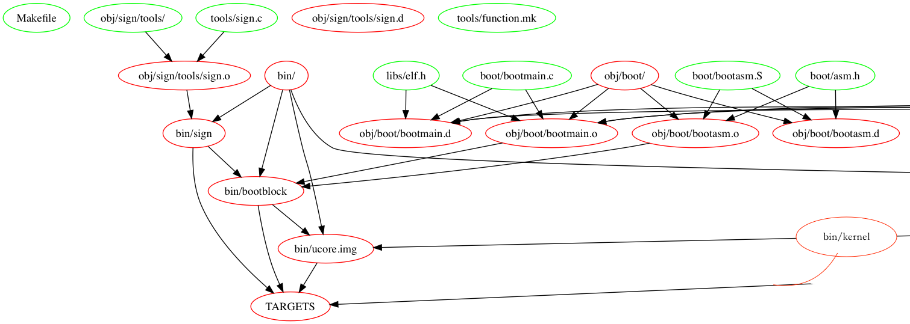

# lab1 

> hughshine at github

[TOC]

## 练习一：make生成执行文件的过程


### 1.分析ucore.img的生成过程

#### 1.1 终端输出分析

makefile以树形结构递归的进行编译，通过一些软件可以绘制出依赖树。本项目的递归树为以下。由于`bin/kernel`太长了，所以只截取关键部分。

```
make -Bnd | make2graph | dot -Tpng -o out.png
```




`TARGETS`是Makefile中定义的`.DEFAULT_GOAL`，用于脚本监视核心文件，即`bin/sign` ，`bin/bootblock` ，`bin/kernel` ，`bin/ucore.img `。`bin/ucore.img `是实际的项目最终target。`bin/bootblock`依赖`bin/sign`，后与`bin/kernel`一起生成`ucore.img`。下面将逐一分析它们的作用。

首先宏观的分析`img`生成的过程，查看实际执行了什么：

```shell
make clean  # make -n 可以查看所有将执行的命令。
make "V="
```

可以发现make按以下顺序编译了文件，然后link了重要的二进制文件。中间报出了一些warning（省略掉了），在最后，借助dd，将`bin/bootblock`与`bin/kernel`按照操作系统的需求连接到了一起。
```shell
cc kern/init/init.c
# ...
# 编译大量kernel的基础功能
ld bin/kernel
cc boot/bootasm.S
cc boot/bootmain.c
cc tools/sign.c
# gcc -g -Wall -O2 obj/sign/tools/sign.o -o bin/sign
ld bin/bootblock
# 整合bootasm.o与bootmain.o，并将start段放在0x7C00的位置
i386-elf-ld -m    elf_i386 -nostdlib -N -e start -Ttext 0x7C00 obj/boot/bootasm.o obj/boot/bootmain.o -o obj/bootblock.o
# ...
# objcopy把一种目标文件中的内容复制到另一种类型的目标文件中.
i386-elf-objcopy -S -O binary obj/bootblock.o obj/bootblock.out
# bin/sign对bootblock进行了检查，并生成bin/bootblock
bin/sign obj/bootblock.out bin/bootblock
# 检查的输出
'obj/bootblock.out' size: 492 bytes
build 512 bytes boot sector: 'bin/bootblock' success!
...
dd if=/dev/zero of=bin/ucore.img count=10000  # 初始化空盘
dd if=bin/bootblock of=bin/ucore.img conv=notrunc  # 先连bootblock, 它需要被放在第一个扇区
dd if=bin/kernel of=bin/ucore.img seek=1 conv=notrunc  # 在第一个块后接上
```

下面给出了使用的dd命令的参数与其具体意义。

```shell
man dd  
# dd: convert and copy a file
if=<infile>
of=<outfile>
seek=n  # Seek n blocks from the beginning of the output before copying. 
cov=notrunc  # Do not truncate the output file.
count=n  # Copy only n input blocks.
```

#### 1.2 sign, bootblock, kernal的作用与生成脚本分析

##### `bin/sign`

`bin/sign`文件的作用：从上面对运行指令的分析，可以看到`bin/sign`主要用来对`obj/bootblock.out`进行检查，并进一步生成`bin/bootblock`。我对它的原始c文件`tools/sign.c`进行了注释。

```c
#include <stdio.h>
#include <errno.h>
#include <string.h>
#include <sys/stat.h>

int
main(int argc, char *argv[]) {
    struct stat st; //_stat结构体是文件（夹）信息的结构体，与stat(filename, buf)配合获取文件信息。
    if (argc != 3) {//检查输入参数数量
        fprintf(stderr, "Usage: <input filename> <output filename>\n");
        return -1;
    }
    if (stat(argv[1], &st) != 0) {//检查输入文件
        fprintf(stderr, "Error opening file '%s': %s\n", argv[1], strerror(errno));
        return -1;
    }
    printf("'%s' size: %lld bytes\n", argv[1], (long long)st.st_size); //输出文件大小
    if (st.st_size > 510) {//如果文件大于510，则报错退出。最后两个字节需要保存标志位。
        fprintf(stderr, "%lld >> 510!!\n", (long long)st.st_size);
        return -1;
    }
    //检查结束，以下代码生成目标文件
    char buf[512];     // 多余位被用0填充
    memset(buf, 0, sizeof(buf));
    FILE *ifp = fopen(argv[1], "rb");
    int size = fread(buf, 1, st.st_size, ifp); //读取blockmain.out
    if (size != st.st_size) { //读取结束后再检查一次，可能读取过程文件发生了改变
        fprintf(stderr, "read '%s' error, size is %d.\n", argv[1], size);
        return -1;
    }
    fclose(ifp); //关掉文件流
    buf[510] = 0x55; // 结束标志位
    buf[511] = 0xAA; // 结束标志位
    FILE *ofp = fopen(argv[2], "wb+"); //准备输出
    size = fwrite(buf, 1, 512, ofp); //将buf输出去
    if (size != 512) { //输出结束，再检查一次
        fprintf(stderr, "write '%s' error, size is %d.\n", argv[2], size);
        return -1;
    }
    fclose(ofp); //关闭输出文件流
    printf("build 512 bytes boot sector: '%s' success!\n", argv[2]); // 输出成功信息
    return 0;
}

```

`bin/sign`的生成过程：

```shell
# -I <value> Add directory to include search path
# -g debug mode
# -Wall 输出warning
# -O2 O2级别的优化
# -c Only run preprocess, compile, and assemble steps
# -o 指明output file
gcc -Itools/ -g -Wall -O2 -c tools/sign.c -o obj/sign/tools/sign.o
gcc -g -Wall -O2 obj/sign/tools/sign.o -o bin/sign
```

##### `bin/bootblock`

`bin/bootblock`文件的作用：作为放在主引导扇区的代码，它主要用于初始化寄存器，完成实模式到保护模式的转换。其中为向后兼容，还做了许多检查。

`bin/bootblock`文件的生成过程：

```shell
# -march=cpu-type allows GCC to generate code that may not run at all on processors other than the one indicated
# -fno-* 一些优化选项
# -ggdb 是 -g的另一种写法
# 32位register
# -gstabs Produce debugging information in stabs format (if that is supported)
# -nostdinc Disable standard #include directories for the C++ standard library 因为不需要
# -Os 主要是对程序的尺寸进行优化。

i386-elf-gcc -Iboot/ -march=i686 -fno-builtin -fno-PIC -Wall -ggdb -m32 -gstabs -nostdinc  -fno-stack-protector -Ilibs/ -Os -nostdinc -c boot/bootasm.S -o obj/boot/bootasm.o

i386-elf-gcc -Iboot/ -march=i686 -fno-builtin -fno-PIC -Wall -ggdb -m32 -gstabs -nostdinc  -fno-stack-protector -Ilibs/ -Os -nostdinc -c boot/bootmain.c -o obj/boot/bootmain.o

# -m Don't treat multiple definitions as an error. !!!好像被废弃了。
# -nostdlib Do not use the standard system startup files or libraries when linking. No startup files and only the libraries you specify will be passed to the linker, and options specifying linkage of the system libraries, such as -static-libgcc or -shared-libgcc, are ignored.
# -e symbol_name Specifies the entry point of a main executable. 
# -T scriptfile Use scriptfile as the linker script. 存疑，感觉此处 -Ttext不是做这个的？
# -N Set the text and data sections to be readable and writable. Also, do not page-align the data segment, and disable linking against shared libraries. 
i386-elf-ld -m    elf_i386 -nostdlib -N -e start -Ttext 0x7C00 obj/boot/bootasm.o obj/boot/bootmain.o -o obj/bootblock.o

i386-elf-ld -m    elf_i386 -nostdlib -N -e start -Ttext 0x7C00 obj/boot/bootasm.o obj/boot/bootmain.o -o obj/bootblock.o
```

##### `bin/kernel`

`bin/kernel`文件的作用：就是操作系统主要的内容啦，第一个练习不多加探讨。

`bin/kernel`文件的生成过程：以下只展示生成kernel的这一句。就是把一堆文件link起来，按照`tools/kernel.ld`中的规则。

```shell
# -T scriptfile Use scriptfile as the linker script. 这里应该是比较准确的。
# 别的前面都提过了。
i386-elf-ld -m    elf_i386 -nostdlib -T tools/kernel.ld -o bin/kernel  obj/kern/init/init.o obj/kern/libs/readline.o obj/kern/libs/stdio.o obj/kern/debug/kdebug.o obj/kern/debug/kmonitor.o obj/kern/debug/panic.o obj/kern/driver/clock.o obj/kern/driver/console.o obj/kern/driver/intr.o obj/kern/driver/picirq.o obj/kern/trap/trap.o obj/kern/trap/trapentry.o obj/kern/trap/vectors.o obj/kern/mm/pmm.o  obj/libs/printfmt.o obj/libs/string.o
```

#### 1.3 Makefile源码简单分析

再简单分析一下makefile的源码。

makefile的规则，就是一个，即:

```makefle
target: prerequisits
	command
```

并有一些衍生技巧，和类似语法糖的东西。并有五种内容显式规则、隐晦规则、变量定义、文件指示和注释。

项目中的Makefile脚本主要使用了变量、函数、伪目标文件，利用了隐晦规则等等。有好多地方太过细节了，只做了大致了解，感觉可读性不好（尤其是变量，函数那里）。主要参考了这份[资料](<https://blog.csdn.net/ruglcc/article/details/7814546>)，可以跟着它读懂Makefile。由于make支持直接输出将要执行指令，分析编译过程更直接，所以不在此讨论Makefile中的逻辑了。

### 2. 一个被系统认为是符合规范的硬盘主引导扇区的特征是什么？ 

在`1.2`中对sign.c的源码分析可知，引导扇区为512字节，且最后两个字节为标志位`0x55 0xAA`。

## 练习二